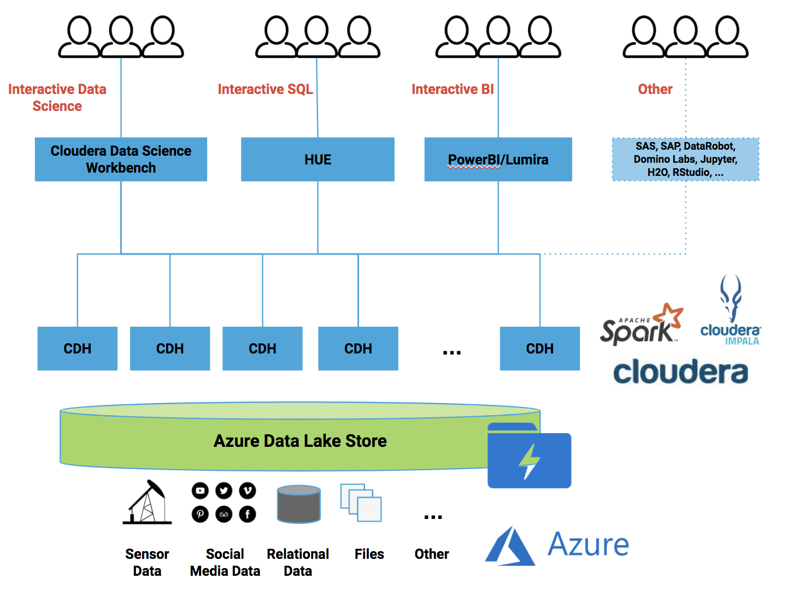

# Welcome to the Cloudera Demo!

This repository contains the code, SQL scripts, and configurations required to
run through a demo of the Cloudera Data Science and Analyst tooling that comes
with the EDH platform. 

## Demo Overview
The demo will take you through a fictional scenario of accessing various types
of data stored in Azure Data Lake Storage (ADLS). The Cloudera platform has a 
deep integration with ADLS, allowing users to de-couple the data storage layer 
(ADLS) from the data processing layer (Spark, Impala, Hive & other CDH services).
The diagram below illustrates a high level architecture of Cloudera on Azure.



## Demo Pre-requisites
This demo assumes the following services have been set up:
* Cloudera Distribution of Hadoop (CDH), including Spark and Impala
* Cloudera Data Science Workbench (CDSW)
* Data stored in ADLS

ADLS credentials with read and write access are also required. You will need:
* Application ID (aka Client ID)
* Application Key
* Refresh URL

## Use Case 1: Processing and Analyzing Twitter Data
The first use case in this demo is analyzing Twitter data stored in ADLS. We will
use Spark, an integral part of the Cloudera platform, to read semi-structured (JSON)
data, clean it, process it, and analyze it. The diagram below illustrates the workflow:


### Steps
#### Setup the Environment
The Cloudera Data Science Workbench (CDSW) is an self-service, interactive development environment for
data scientists to build, share and deploy code and models. It is integrated with the Cloudera platform
and allows users to interact with Spark, Impala, Hive, HDFS and other CDH services securely through a centralized
service running on the cluster. We will use CDSW heavily in this project. 

1. Login to the Cloudera Data Science Workbench and create a new project using this Github repo: ```https://github.com/tomatoTomahto/cloudera-demo```
2. Go into the Project Engine Settings, and add the following environment variables:
  * ADLS_PATH - adls store (ie. adl://myadlsstore.azuredatalakestore.net)
  * TWITTER_RAW_PATH - directory in ADLS containing raw Twitter JSON documents (ie. Twitter/Raw)
  * TWITTER_PROCESSED_PATH - directory in ADLS to write processed Twitter data (ie. Twitter/Processed)
  * SPARK_CONF_DIR - set this to ```resources/spark```
3. Save the Environment
4. Go back to the Project Overview, and click on the Open Workbench button. 
5. In the left pane, find the ```resources/spark-defaults.conf``` file. Edit the following configuration settings to allow Spark to connect to ADLS using your credentials:
  * spark.hadoop.dfs.adls.oauth2.client.id=```Application ID```
  * spark.hadoop.dfs.adls.oauth2.credential=```Application Key```
  * spark.hadoop.dfs.adls.oauth2.refresh.url=```Refresh URL```

#### Clean the Data
Spark is a powerful, distributed, data processing framework that allows developers to transform data
using programming APIs in Java, Scala, Python, and R. CDSW natively has the libraries required to 
interact with Spark interactively through Scala, Python, or R. The scripts used in this demo are primarily
Python or R scripts that leverage these Spark libraries. 

1. Go back to the Project Overview, and create a new Workbench with 1 VCPU and 2GB of memory using the Python 2 Engine
2. Run the script ```Twitter/ProcessTweets.py```. This will clean and process the raw tweets and write the resulting data to ADLS.
3. Review the output of the script in the Workbench, then stop the Workbench


#### Analyze the Data
Once the processed data is stored back into ADLS, there are two ways to analyze the data. Spark, 
combined with open source plotting libraries in R and Python can be used by developers and data 
scientists. 

Alternatively, Impala can be used by data analysts who prefer to interact with the data through SQL,
or a BI tool like PowerBI or Lumira. Impala allows users to create and query tables ontop of data stored 
in ADLS, and is the leading distributed SQL engine in terms of performance, scalability and security. 
Almost every major BI tool, including PowerBI and Lumira, has ODBC, JDBC or native connectors to Impala. 

1. Open another Workbench (1 VCPU, 2GB Mem, Python 2) and run the script ```Twitter/AnalyzeTweets.py```. This will create some visualizations using Spark and Python plotting libraries (seaborn, pandas, matplotlib).
2. Review the output of the script in the Workbench, then stop the Workbench
3. Login to HUE and navigate to the ADLS Browser. Find the processed data that we wrote out to ADLS. 
4. Navigate to the Impala Query Editor. Copy and paste the SQL statements in ```Twitter/ImpalaSchema.sql```
5. Execute the statements in the editor - this will create a database called twitter, and a table ontop of the processed data in ADLS
6. Interactively run queries against the Impala table created. Optionally, connect a BI tool to the Impala twitter database


## Use Case 2: Data Science on Sensor Data
The second use case in this demo is analyzing sensor data being written to ADLS. We will
start by cleansing and transforming the data. Then we will build a regression model to
predict the value of a sensor based on historical readings. The diagram below illustrates
the workflow:


### Steps
### Setup the Environment
We will again use Spark to do most of the heavy lifting - cleansing the data, transforming it, 
and training a regression model. 

1. Within the same project as before, go into the Project Engine Settings and add these environment variables. Make sure that ADLS_PATH and SPARK_CONF_DIR are still set. 
  * RAW_HIST_DATA_PATH - directory in ADLS containing the raw historian data 
  * PROC_HIST_DATA_PATH - directory in ADLS to store the processed historian data
  * MODEL_DEV_PATH - directory in ADLS to store ML models in development 
2. Save the Environment

### Clean the Data
The data is assumed to be in CSV format, with fields for a timestamp, and value. The device ID 
is embedded in the name of the file. This step splits the data into 2 smaller datasets, one for 
model training and one for model testing.

1. Open a Workbench with 1VCPU and 2GB memory running the Python 2 Engine
2. Run the script ```Time-Series/CleanseData.py```. This will process raw historian data from ADLS and store it into a cleansed directory. 
3. Review the output of the script, then close the Workbench

### Train a Regression Model
Once the data is clean, we can build a regression model against the training data. Spark
has an entire library for machine learning called [MlLib](https://spark.apache.org/docs/latest/ml-guide.html). Spark MlLib allows users to do
feature engineering, regression, classification, ensemble learning, clustering, collaborative
filtering, pipelining and more. 

1. Open a Workbench with 1VCPU and 2GB memory running the Python 2 Engine
2. Run the script ```Time-Series/BuildModel.py```. This transforms the cleansed data in ADLS and builds a simple linear regression model. That model is then saved to ADLS for further testing. 
3. Review the output of the script and close the Workbench. 

### Test a Regression Model
Once a model has been saved to ADLS, it can be tested or deployed against production or live data. In this step
we load the model into a script and use it to score test data. The results (actual vs. predictions) are then
analyzed and written out to ADLS. 

1. Open a Workbench with 1VCPU and 2GB memory running the Python 2 Engine
2. Run the script ```Time-Series/TestModel.py```. This loads test data from ADLS and scores it with the model from the previous step. 
3. Review the output of the script and close the Workbench. 

### Analyze the Results
Once the predictions are stored in ADLS, they can be analyzed via Impala through SQL or a BI tool. 

1. Login to HUE, go to the Impala Query Editor and run the SQL statements in ```Time-Series/ImpalaQueries.sql```. This will create a table against the scored data in ADLS so it can be analyzed using SQL.
2. Back in the Workbench, run the ```refreshImpala.py``` script to refresh the tables to read new data in new partitions on ADLS. 
3. Interactively run queries against the Impala table created. Optionally, connect a BI tool to the Impala twitter database